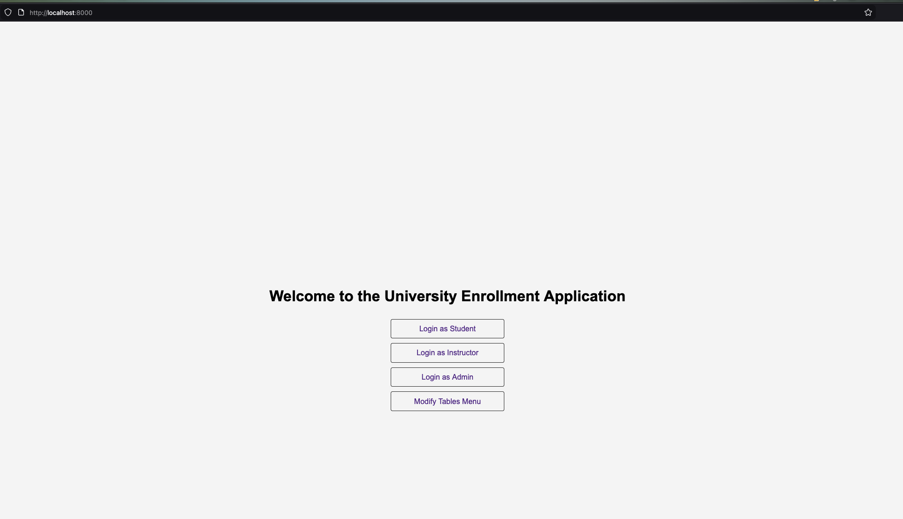

# CPS510 A9: University Enrollment (Django)

Quick instructions to build and run this Django webapp on localhost.

Prerequisites
- Python 3.10+
- pip

## Initial Setup
**1. Clone this Github Repository**

    git clone https://github.com/nicholas489/university_enrollment.git

**2. Change into this Repo's Directory and run the following CLI command to get django package:**

    pip install django

**3. Apply DB Migrations**

    python3 manage.py migrate

**4. Seed Mock User Data**

    python3 manage.py seed_mock_data

## How to Run Program

**1. Run the web server**

    python3 manage.py runserver

## Usage/Testing

- Head to [localhost:8000](http://localhost:8000) and login with a Student/Instructor/Admin account
- To login with a Student Account, use the following email/password credentials:
    - `john.jason@torontomu.ca`
    - `jason1234`
- To login with a Instructor Account, use the following email/password credentials:
    - `abhari@torontomu.ca`
    - `abdolreza1234`
- To login with a Admin Account, use the following username/password credentials:
    - `admin1`
    - `adminpass`
